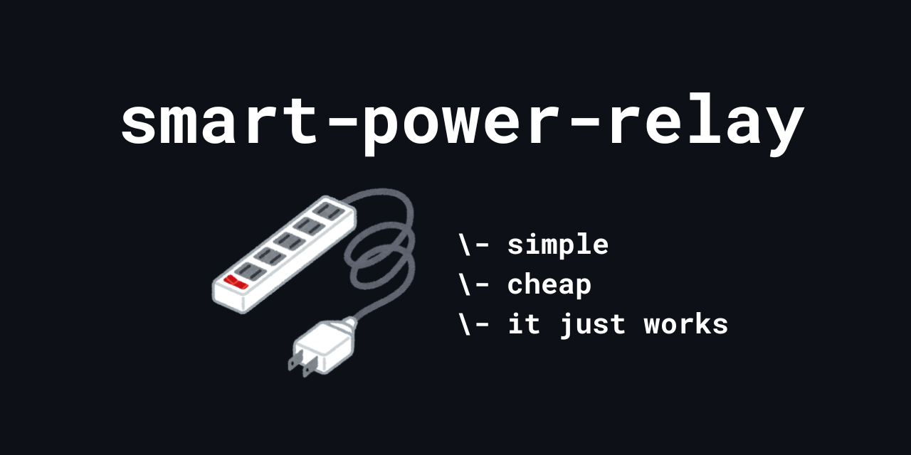

  
  
  
  

## Overview
- **Goal:** A simple relay box that is smart controlled
- **Why:** Control lights.
- **Out of scope:** More industrial uses

## Highlights
- 3D Printed Enclosure
- ESPHome to Home Assistant
- Simple Assembly
- Robust yet easy design

## Roadmap
- [ ] Design a variant that uses an IEC inlet
- [ ] Power the micro-controller from mains
- [ ] Include a momentary switch (software toggle)

## Results
- **What works:**
    - Powering an outlet via ESPHome!
    - Nothing much else really...
- **What doesn’t (yet):**
    - Powering the micro-controller from mains input
- **Measurements:**
    - 84 x 70 x 32 (L x W x H) [mm]

## Requirements
### BOM / Parts List

#### Electronics:
- [WROOM ESP32 CH340C Type-C Micro-controller](https://de.aliexpress.com/item/1005005953505528.html)
- [3.3V Single Channel Relay](https://de.aliexpress.com/item/1005007693151843.html)
- 3x Female to Female jumper (DuPont) cables

#### Hardware:
- Male Cable Plug
- Female Cable Plug
- ~40cm 3-core mains cable (L/N/PE)
- 6x M3x8mm Bolts
- 4x M3x10mm Bolts
- 4x M3 Nuts
- 2x Zipties

#### 3D Printed:
- [Box Base](CAD/stls/v1/box.stl)
- [Box Lid](CAD/stls/v1/lid.stl)

> [!CAUTION]
> I'd reccomend printing these pieces in PETG or any high-temp tolerating material to prevent the chances of heat warping the case.

#### Tools:
- Phillips Screwdriver
- Hex Screwdriver (for M3 bolts)

### Software Setup
Use an ESPHome docker container or [ESPHome Web](https://web.esphome.io/) instance using a browser that supports WebSerial (Chrome / Edge). Create a new config with [this](example-esphome-config.yaml) template. Flash! Open Home Assistant and pair...

## How to Contribute
### Issues
Please fill out and submit the issue template when submitting an issue.

## License(s)
Firmware, config snippets & scripts: **MIT License**

Hardware design files (STL/CAD, schematics, wiring diagrams): **CERN-OHL-S v2**

Documentation (README, guide text, photos): **CC BY 4.0**

## Contact
Not yet available! Sorry
